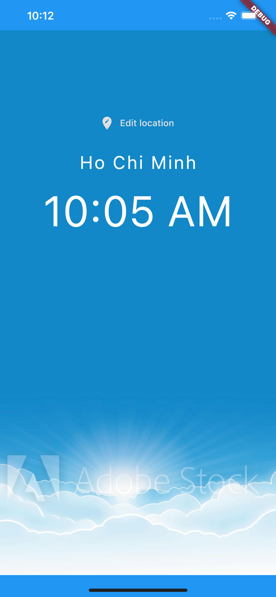
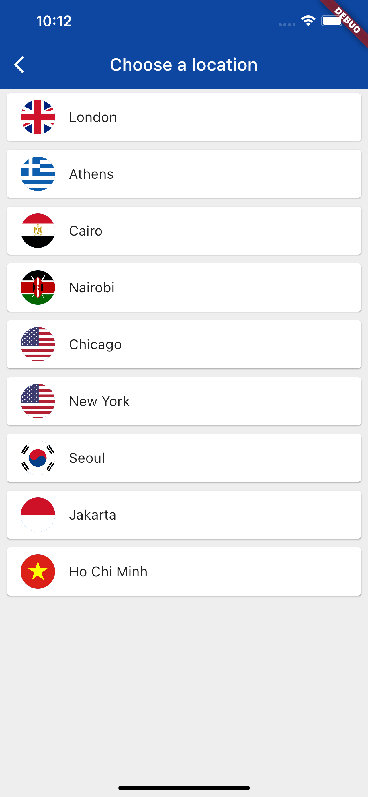

# Flutter World Time app
### A basic Flutter app that shows the user what the time is in different places around the world
This is a basic app I made to practise my Flutter skills. This app can be used by the user to find out what the time is in different places around the world. I used the [World Time API](http://worldtimeapi.org/timezones) to get the times from all the cities. This makes the app completly modular. Any city can be added with just a few lines of code.

### Screenshots of the app
##### This is the homescreen in the morning (this is shown when you open the app)

##### This is the homescreen in the morning (this is shown when you open the app)

##### This is the selection screen (this opens when the "edit location" button is clicked)

